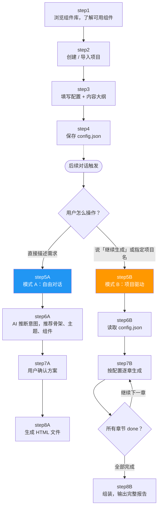

# 报告生成流程

| | 模式 A（自由对话） | 模式 B（项目驱动） |
|---|---|---|
| **前置操作** | 无，直接开始 | step1-4：浏览组件库 → 创建项目 → 填写配置 → 保存 |
| **怎么触发** | 直接描述需求 | 说"继续生成"或指定项目名 |
| **配置来源** | AI 根据描述推断推荐 | 从 config.json 读取 |
| **适用场景** | 快速原型、单页需求 | 多章节正式报告 |
